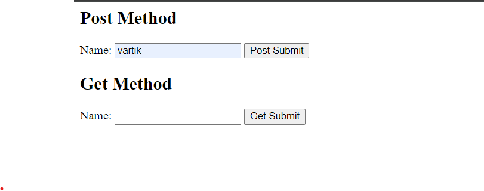

# Aim
08 . Write two different PHP scripts to demonstrate passing variables through a URL
## Code

### Index.php
```html
<html lang="en">
<head>
    <meta charset="UTF-8">
    <meta name="viewport" content="width=device-width, initial-scale=1.0">
    <title>Passing Variables</title>
</head>
<body>

    <h2>Post Method</h2>

    <form action="post.php" method="post">
        <label for="name">Name:</label>
        <input type="text" id="name" name="name" required>

        <label for="age">Age:</label>
        <input type="number" id="age" name="age" required>

        <input type="submit" value="Post Submit">
    </form>


    <h2>Get Method</h2>

<form action="get.php" method="get">
    <label for="name">Name:</label>
    <input type="text" id="name" name="name" required>

    <label for="age">Age:</label>
    <input type="number" id="age" name="age" required>

    <input type="submit" value="Get Submit">
</form>

</body>
</html>


```


### post.php
```html
<?php
if ($_SERVER["REQUEST_METHOD"] == "POST") {
    $name = $_POST['name'];
    $age =$_POST['age'];

    echo "<h2>POST Result</h2>";
    echo "<p>Name: $name</p>";
    echo "<p>Age: $age</p>";
} else {
    echo "<p>No data received.</p>";
}
?>


```


### get.php
```html
<?php
if ($_SERVER["REQUEST_METHOD"] == "GET") {
    // Sanitize input
    $name = $_GET['name'];
    $age = $_GET['age'];

    echo "<h2>GET Result</h2>";
    echo "<p>Name: $name</p>";
    echo "<p>Age: $age</p>";
} else {
    echo "<p>No data received.</p>";
}
?>


```
## Output
### Index.php



### post.php Output


### get.php Output

