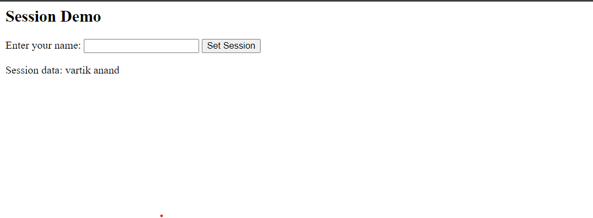

# Aim
<!-- 09 Write two different PHP scripts to demonstrate passing variables with sessions. -->

## Code
### index.php
```html
<html lang="en">

<body>
    <h2>Session Demo</h2>
    
    <form action="session.php" method="post">
        <label for="name">Enter your name:</label>
        <input type="text" id="name" name="name" required>
        <button type="submit">Set Session</button>
    </form>

    <?php
    // Display the session data if it's set
    session_start();
    if (isset($_SESSION['username'])) {
        echo '<p>Session data: ' . $_SESSION['username'] . '</p>';
    }
    ?>
</body>
</html>

```
### session.php
```html
<?php
// Start the session
session_start();

// Check if the name is submitted
if (isset($_POST['name'])) {
    // Set the session variable
    $_SESSION['username'] = $_POST['name'];

} 

// Redirect back to the HTML page
header("Location: index.php");
exit();
?>


```

## Output

