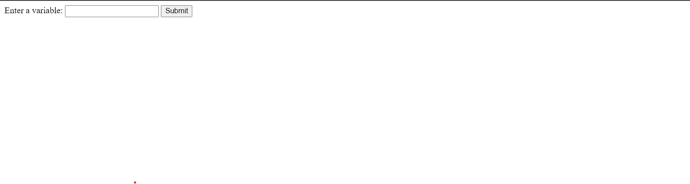
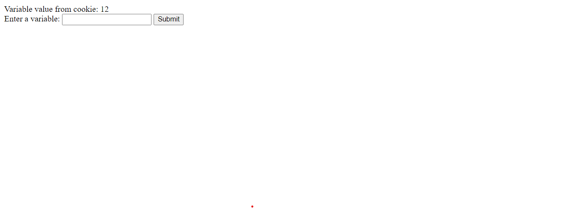

# Aim
<!-- 10 Write PHP script to demonstrate passing variables with cookies -->

## Code

```html
<?php
// Check if the form is submitted
if ($_SERVER['REQUEST_METHOD'] === 'POST') {
    // Get the value from the form
    $userInput = $_POST['user_input'];

    // Set a cookie with the variable
    setcookie('user_variable', $userInput, time() + 10); // Expires in 1 hour
}

// Check if the cookie is set
if (isset($_COOKIE['user_variable'])) {
    $storedVariable = $_COOKIE['user_variable'];
    echo "Variable value from cookie: $storedVariable";
}
?>

<html lang="en">

<body>

<form method="post" action="">
    <label for="user_input">Enter a variable:</label>
    <input type="text" id="user_input" name="user_input">
    <button type="submit">Submit</button>
</form>

</body>
</html>


```
## Output 




### refresh the current page to see the cookie data

