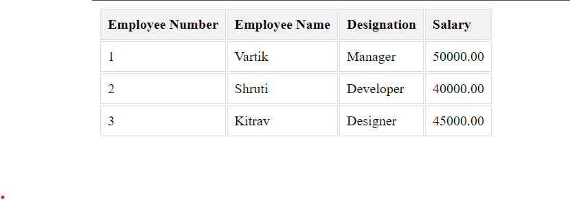

# Aim
Create EMP table with emp_no, emp_name, designation, and salary. Write a program to read employee information from the EMP table and display all this information in the PHP pag


## Code

### index.php
```html
 <html lang="en">
<head>
    <style>
        th, td {
            border: 1px solid #ddd;
            padding: 8px;
            text-align: left;
        }

        th {
            background-color: #f2f2f2;
        }
    </style>
</head>
<body>

<?php
// Create connection
$conn = mysqli_connect('localhost', 'root', '', 'vartikdb');

// Check connection
if (!$conn) {
    die("Connection failed: ");
}

$sql = "SELECT * FROM EMP";
$result = mysqli_query($conn, $sql);

if ($result) {
        echo "<table>
                <tr>
                    <th>Employee Number</th>
                    <th>Employee Name</th>
                    <th>Designation</th>
                    <th>Salary</th>
                </tr>";

        while ($row = mysqli_fetch_assoc($result)) {
            echo "<tr>
                    <td>" . $row["emp_no"] . "</td>
                    <td>" . $row["emp_name"] . "</td>
                    <td>" . $row["designation"] . "</td>
                    <td>" . $row["salary"] . "</td>
                  </tr>";
        }
        echo "</table>";
    }
else {
    echo "Error: " . $sql . "<br>" . mysqli_error($conn);
}

mysqli_close($conn);
?>

</body>
</html>


```

####

## Mysql Query (OPTIONAL)

```sql

CREATE TABLE EMP (
    emp_no INT PRIMARY KEY,
    emp_name VARCHAR(50),
    designation VARCHAR(50),
    salary DECIMAL(10, 2)
);

-- Insert some sample data
INSERT INTO EMP (emp_no, emp_name, designation, salary)
VALUES
    (1, 'Vartik', 'Manager', 50000.00),
    (2, 'Shruti', 'Developer', 40000.00),
    (3, 'Kitrav', 'Designer', 45000.00);

```


## Output

