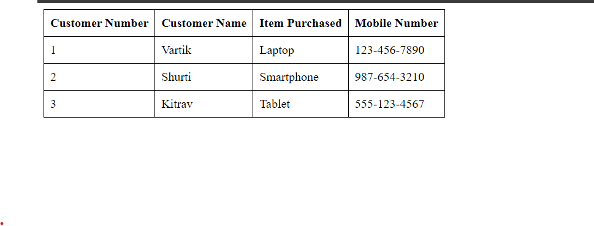

# Aim
5. Write a PHP script to obtain the factorial of a number using the function

## Code

```PHP

<?php


// Create connection
$conn = new mysqli('localhost', 'root', '', 'vartikdb');

// Check connection
if (!$conn) {
    die("Connection failed: " );
}

// SQL query to select customer information
$sql = "SELECT * FROM customer";
$result = $conn->query($sql);

// Display customer information in a table
echo "<html><head><style>table, th, td {border: 1px solid black; border-collapse: collapse; padding: 8px;}</style></head><body>";
echo "<table>";
echo "<tr><th>Customer Number</th><th>Customer Name</th><th>Item Purchased</th><th>Mobile Number</th></tr>";

if ($result->num_rows > 0) {
    
    while($row = $result->fetch_assoc()) {
        echo "<tr><td>".$row["cust_no"]."</td><td>".$row["cust_name"]."</td><td>".$row["item_purchased"]."</td><td>".$row["mob_no"]."</td></tr>";
    }
} else {
    echo "<tr><td colspan='4'>No records found</td></tr>";
}

echo "</table></body></html>";

$conn->close();
?>


```

### Mysql query (optional) :

```SQL
-- Create Customer table
CREATE TABLE Customer (
    cust_no INT PRIMARY KEY,
    cust_name VARCHAR(255),
    item_purchased VARCHAR(255),
    mob_no VARCHAR(15)
);

-- Insert data for Vartik
INSERT INTO Customer (cust_no, cust_name, item_purchased, mob_no)
VALUES
    (1, 'Vartik', 'Laptop', '123-456-7890');

-- Insert data for Shurti
INSERT INTO Customer (cust_no, cust_name, item_purchased, mob_no)
VALUES
    (2, 'Shurti', 'Smartphone', '987-654-3210');

-- Insert data for Kitrav
INSERT INTO Customer (cust_no, cust_name, item_purchased, mob_no)
VALUES
    (3, 'Kitrav', 'Tablet', '555-123-4567');


```

## Output

