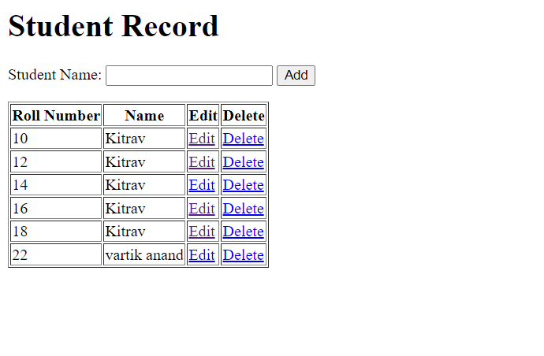
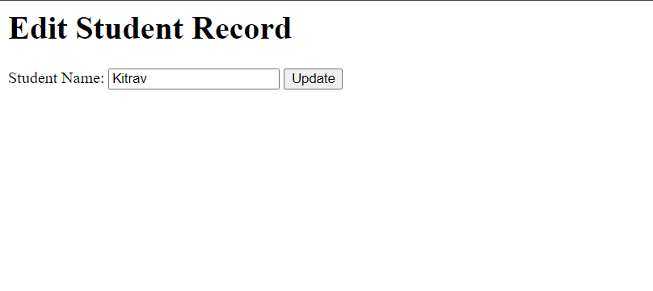

# Aim
Create a dynamic website using PHP and MySQL for this all
## Code
### Index.php
```PHP
<?php
$conn = mysqli_connect('localhost', 'root', '', 'vartikdb');

if (!$conn) {
    echo "Error ";
}

if (isset($_POST['Add'])) {
    $name = $_POST['name'];
    $sql = "INSERT INTO STUDENTS (`name`) VALUES ('$name')";

    if (mysqli_query($conn, $sql)) {
        echo "Record inserted successfully";
    }
}

?>

<html lang="en">

<body>
    <h1>Student Record</h1>
    <form method="post" action="">
        <label for='name'>Student Name:</label>
        <input type='text' id='name' name='name'>
        <input type='submit' name='Add' value='Add'>
    </form>

    <table border="1">
        <tr>
            <th>Roll Number</th>
            <th>Name</th>
            <th>Edit</th>
            <th>Delete</th>
        </tr>

        <?php
        $sql = "SELECT * FROM STUDENTS";
        $result = mysqli_query($conn, $sql);

        while ($row = mysqli_fetch_assoc($result)) {
            echo "<tr>";
            echo "<td>". $row['roll_number']. "</td>"; // Adjust the column name if necessary
            echo "<td>". $row['name']. "</td>";
            echo "<td><a href='edit.php?id=".$row['roll_number']."'>Edit</a></td>"; // Assuming 'edit.php' handles the editing
            echo "<td><a href='delete.php?id=".$row['roll_number']."'>Delete</a></td>"; // Assuming 'delete.php' handles the deletion
            echo "</tr>";
        }
        ?>

    </table>

    <?php
    mysqli_close($conn);
    ?>

</body>
</html>


```
### edit.php
```PHP 
<?php
$conn = mysqli_connect('localhost', 'root', '', 'vartikdb');

if (!$conn) {
    die("Connection failed: " . mysqli_connect_error());
}

if (isset($_GET['id'])) {
    $roll_number = $_GET['id'];

    if ( isset($_POST['Update'])) {
        // Update the record based on the form submission
        $newName =$_POST['name'];
        $sql = "UPDATE STUDENTS SET name = '$newName' WHERE roll_number = '$roll_number'";
        $result = mysqli_query($conn, $sql);

        if ( $result) {
            // Redirect to index.php after successful update
            header("Location: index.php");
            exit();
        } else {
            echo "Error updating record.";
        }
    }

    // Fetch the record based on the roll_number
    $sqlSelect = "SELECT * FROM STUDENTS WHERE roll_number = '$roll_number'";
    $resultSelect = mysqli_query($conn, $sqlSelect);

    if ($resultSelect && $row = mysqli_fetch_assoc($resultSelect)) {
        // Display the form with the data for editing
?>
        <html lang="en">
        <head>
            <title>Edit Student</title>
        </head>
        <body>
            <h1>Edit Student Record</h1>
            <form method="post" action="">
                <input type="hidden" name="roll_number" value="<?= $row['roll_number']; ?>">
                <label for="name">Student Name:</label>
                <input type="text" id="name" name="name" value="<?= $row['name']; ?>">
                <input type="submit" name="Update" value="Update">
            </form>
        </body>
        </html>
<?php
    } else {
        echo "Error fetching record.";
    }
}

mysqli_close($conn);
?>

```

### delete.php
```PHP 
<?php
$conn = mysqli_connect('localhost', 'root', '', 'vartikdb');

if (!$conn) {
    die("Connection failed: " . mysqli_connect_error());
}

if (isset($_GET['id'])) {
    $roll_number = $_GET['id'];

    // Delete the record based on the roll_number
    $sql = "DELETE FROM STUDENTS WHERE roll_number = '$roll_number'";
    $result = mysqli_query($conn, $sql);

    if ($result) {
        echo "Record deleted successfully";
    } else {
        echo "Error: " . mysqli_error($conn);
    }
}
header("Location: index.php");
mysqli_close($conn);
?>

```
## Output

### index.php


### edit.php
